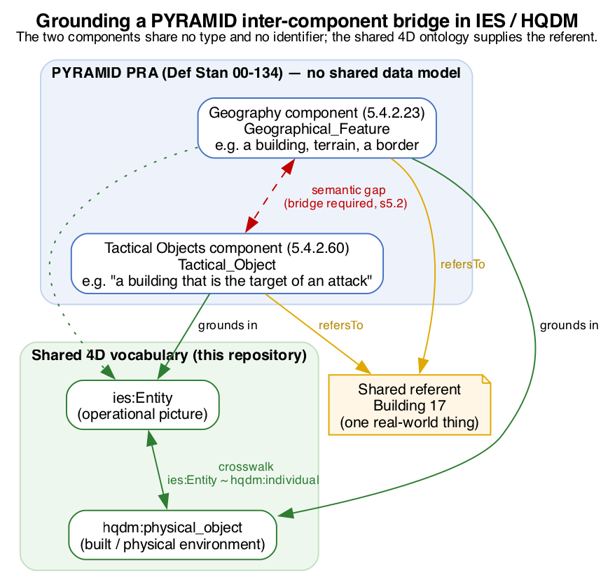

# Worked bridge: grounding a PYRAMID inter-component connection in IES/HQDM

A worked example of the crosswalk in use. It shows that when two [PYRAMID](https://www.gov.uk/guidance/pyramid-rapid-adaptability-for-avionics-systems) Reference Architecture (PRA) components have to be connected, the semantic gap PYRAMID itself names can be closed against a shared, published 4D vocabulary instead of a bespoke, per-deployment mapping. The point is narrow and concrete: an IES/HQDM grounding lets two components that model the same real-world object from different perspectives resolve to one referent, checkably.

This is illustrative, built entirely on public standards and open ontologies. It is not affiliated with or endorsed by the MOD PYRAMID programme, and asserts nothing about any real system or deployment.

## Why this exists: PYRAMID has the gap, not the fill

PYRAMID is an MOD-owned open **avionics software reference architecture** (PYRAMID Technical Standard V1.0, adopted as Def Stan 00-134, released under the Open Government Licence). Its core artefact is a set of 73 software component definitions, each bounding one subject matter with its own **subject-matter-semantics** entities and relationships.

The architecture is deliberately **not** built on a shared data model. Its own Technical Standard is explicit (s5.2):

> "Since each PRA component represents a distinct subject [matter] ... a deployment will use **bridges to close the semantic gap**, aligning the interfaces between components so that they are able to share information."

and lists, as a bridge function:

> "**Data element mapping** (translating the meaning of data in order to bridge the semantic gap ...)."

The BAE Systems / MOD / Open Group compatibility assessment (2024) puts it plainly: "**Whilst the PRA does not define a data architecture**, it recognises that a data architecture is needed to enable components to interact."

So PYRAMID standardises how components *plug together* and explicitly leaves *what the data means across them* to per-deployment bridges. That is exactly the slot a shared 4D ontology fills. This example supplies the reference semantics for one such bridge.

## The two components

Both are taken verbatim from the public Technical Standard.

- **Geography** (s5.4.2.23). Role: "to represent information about geographical features, including their location and the relationships between them." Its central entity is **`Geographical_Feature`**: "a geographical feature of the Earth ... e.g. a specific river, the land border between two countries, or a star", explicitly "tangible (e.g. buildings) and intangible (e.g. a country border)".
- **Tactical Objects** (s5.4.2.60). Subject matter: "objects of tactical importance which exist ... within the battlespace, their Relationships ... and their Behaviour." Its central entity is **`Tactical_Object`**: "an entity in the battlespace ... A tactical object has associated characteristics (e.g. allegiance, classification, location and kinematics)", and the standard's own example of one is "**a building that is the target of an attack**".

## The semantic gap, made concrete

A single building is a `Geographical_Feature` to Geography (a static terrain feature with a location) and, simultaneously, a `Tactical_Object` to Tactical Objects (a battlespace entity with allegiance, classification and behaviour). The two components **share no type and no identifier**. Nothing in the PRA tells a deployment that the two local objects denote the same building; a bridge must establish it. This is the gap the Technical Standard describes, in one object.

### D1. Same referent, two local types

`pyrgeo:GeographicalFeature` and `pyrtac:TacticalObject` are disjoint, component-local types for what can be one physical thing. Grounding both in `ies:Entity` (and, for the tangible spatial side, `hqdm:physical_object` via the crosswalk's `ies:Entity ~ hqdm:individual` correspondence) gives the bridge a single referent to co-reference. See [`bridge.ttl`](bridge.ttl).

### D2. `Capability` is a false friend across components

Both components define an entity called **`Capability`**, and they do not mean the same thing. In Geography it is "the range of services that can be performed ... e.g. the ability to provide information on a particular region". In Tactical Objects it is "the capability to ... maintain knowledge of Tactical_Objects ... through the available Object_Information_Sources". A bridge that unifies them on the shared label corrupts both. This is the same class of error as the crosswalk's headline `ies:Event` / `hqdm:event` false friend (see [`../DIVERGENCES.md`](../DIVERGENCES.md) #1): the grounding records the two `Capability` entities separately and at low confidence precisely to forbid that unification.

### D3. `Relationship` is non-atomic

Tactical Objects' `Relationship` entity covers both a mereological association ("equipment on a vehicle, or vehicles within a formation") and a general one ("a missile targeting an aircraft"). The former grounds in `ies:isPartOf` (`~ hqdm:part_of`); the latter is a happening with participants, an `ies:Event`. A faithful bridge splits the entity rather than forcing one correspondence. The grounding flags it and keeps the confidence low.

## The grounding

[`pyramid-entities-grounding.sssom.tsv`](pyramid-entities-grounding.sssom.tsv) records each PRA entity's correspondence to an IES/HQDM term in [SSSOM](https://mapping-commons.github.io/sssom/): subject, predicate, object, justification, confidence, comment. The high-confidence backbone is the pair the bridge turns on:

| PRA entity (component) | IES/HQDM grounding | Predicate | Conf. |
|---|---|---|---|
| `Tactical_Object` (Tactical Objects) | `ies:Entity` | closeMatch | 0.85 |
| `Geographical_Feature` (Geography) | `hqdm:physical_object`; `ies:Entity` | closeMatch | 0.72 / 0.60 |
| `Behaviour` (Tactical Objects) | `ies:State` | closeMatch | 0.80 |
| `Feature_Type` (Geography) | `ies:ClassOfElement` | closeMatch | 0.70 |
| `Type_of_Interest_Requirement` (Tactical Objects) | `ies:ClassOfEntity` | closeMatch | 0.60 |
| `Capability` (both, separately) | — false friend, do not unify | relatedMatch | 0.20 |
| `Relationship` (Tactical Objects) | `ies:isPartOf` + `ies:Event` (split) | relatedMatch | 0.45 |

`ies:Entity` sitting under both `Tactical_Object` and `Geographical_Feature` is the whole point: it is the crosswalk's `ies:Entity ~ hqdm:individual` correspondence that lets the operational picture (IES) and the terrain (HQDM) name the same building. This is the crosswalk's founding motivation reduced to one bridge.

## Why this composes

Without a shared vocabulary, the Geography-to-Tactical-Objects bridge is bespoke: hand-built for this deployment, re-derived for the next, and opaque to a third supplier's component. Grounded in IES/HQDM, the same bridge is stated over published terms, so a second component that also grounds `Tactical_Object` in `ies:Entity` composes with it, and the co-reference `ex:GF_Building_17 skos:exactMatch ex:TO_Building_17` is a machine-checkable proposition rather than tribal knowledge. PYRAMID guarantees the components can be *connected*; the shared ontology is what lets them *mean the same thing* once connected.

## It generalises beyond one pair

The same grounding extends up the sensing chain. The **Data Fusion** component (s5.4.2.14) produces a **`Fused_Object`**, "the characterisation of a real-world entity, based on Evidence", which becomes a `Tactical_Object` downstream and which Geography also holds as a `Geographical_Feature`. All three ground in `ies:Entity`, so **Sensing to Data Fusion to Tactical Objects to Geography** share one referent type rather than three private ones. The worked example in `bridge.ttl` resolves the same building across all three components (`demo.py` Q4). Data Fusion also supplies the **third** member of the `Capability` false-friend family (`Fusion_Capability`), confirming D2 is a pattern, not a one-off.

## Prior art and novelty

A literature scan (defence C2 ontologies, MOSA/FACE, MBSE-to-OWL) places this precisely:

- **Ontology-mediated C2 interoperability is mature** (JC3IEDM/NFFI to OWL, Nogalski & Najgebauer 2011, through the UPM 2025 federated-systems work), and the **US DoD/IC 2023-24 mandate of BFO + Common Core Ontology** makes upper-ontology grounding of military data official policy, not speculation.
- **The avionics standards stop short of it.** FACE's Shared Data Model is built on UDDL (an entity-relationship language), and PYRAMID on MBSE component definitions; neither is grounded in a foundational 4D ontology. Generic MBSE-to-OWL bridging exists (NIST, arXiv:2206.10454) but is not applied here.
- **The gap is specific and open.** No published work grounds **PYRAMID** in any upper ontology (high confidence), and none grounds the **FACE SDM/UDDL** in BORO/ISO 15926/IES/HQDM/BFO (moderate-high confidence). This worked example occupies that gap: a 4D-ontology grounding for an open-avionics reference architecture's inter-component data, using the published IES and HQDM.

Sources: MOSA Reference Frame (OUSD R&E, 2020); Open Group FACE approach; Nogalski & Najgebauer 2011 (RTO-MP-IST-101); UPM 2025 (Springer LNCS 978-3-032-00633-2); NIST 2022 (arXiv:2206.10454); DoD/IC BFO+CCO mandate (2024).

## The need this serves

UK MOD demands the function and leaves the solution unnamed. The Data Strategy for Defence admits that **fewer than 25% of MOD systems have automatically discoverable data and a third do not follow international standards**, and calls for a shift from platform-centric to data-centric. Yet every enabling programme reaches for transport, access or exchange mechanisms, the Single Information Environment, SAPIENT, FACE, the combat cloud, and **none names an ontology or a shared meaning layer**, even as the Digital Targeting Web (£1.8bn) requires sensor-to-shooter meaning to compose and GCAP (UK-Italy-Japan) requires it across a coalition. US DoD, by contrast, has mandated BFO and the Common Core Ontology; the gap is a transatlantic asymmetry, not a technical impossibility. The UK already owns the two formal ontologies that could fill it, IES (Dstl-stewarded, 4D/BORO) and HQDM (GCHQ-implemented, top-level 4D), but scoped to intelligence and to national infrastructure respectively, never applied to avionics. Because both descend from the same BORO / 4D foundation, they compose, which is what the crosswalk in this repository establishes and what this bridge puts to work beneath PYRAMID.

Sources: Data Strategy for Defence and Digital Strategy for Defence (gov.uk); Defence Investment Plan, 30 June 2026 (gov.uk); Digital Targeting Web case study (gov.uk); DoD/IC BFO+CCO mandate (2024).

## What is here

| Path | What it is |
|---|---|
| `pyramid-entities-grounding.sssom.tsv` | The grounding of the components' entities (Geography, Tactical Objects, Data Fusion) in IES/HQDM, in SSSOM. |
| `bridge.ttl` | The machine-readable bridge: entity groundings, the one-building co-reference across three components, and reified correspondences in the crosswalk's shape. |
| `demo.py` | Runnable proof (rdflib): without grounding the components cannot be joined; with the bridge one building resolves to one referent carrying both worlds' types. |
| `../shapes/bridge-shapes.ttl` | SHACL that enforces the discipline: a co-reference is valid only when both objects share a referent, which forbids the `Capability` false-friend unification. |
| `test/broken-example.ttl` | Negative fixture: the naive unification of the two `Capability` entities, which `bridge-shapes.ttl` must (and does) reject. |
| `bridge-diagram.dot` / `.png` | The bridge in one picture: the semantic gap, the shared referent, the IES/HQDM grounding. |



## Reproduce and verify

```bash
pip install rdflib pyshacl

# 1. Executable proof (expect: RESULT PASS)
python pyramid-bridge/demo.py

# 2. The bridge is well-formed against the crosswalk's own shapes (expect: Conforms True)
pyshacl -s shapes/crosswalk-shapes.ttl -df turtle pyramid-bridge/bridge.ttl

# 3. The bridge satisfies the co-reference discipline (expect: Conforms True)
pyshacl -s shapes/bridge-shapes.ttl -df turtle pyramid-bridge/bridge.ttl

# 4. The naive false-friend unification is rejected (expect: Conforms False)
pyshacl -s shapes/bridge-shapes.ttl -df turtle pyramid-bridge/test/broken-example.ttl
```

## Sources

- **PYRAMID Technical Standard V1.0** (Def Stan 00-134), Open Government Licence v3.0: <https://www.gov.uk/government/publications/pyramid>. Sections cited: 5.2 (bridges), 5.4.2.23 (Geography), 5.4.2.60 (Tactical Objects).
- **Assessment of Compatibility Between the PRA and the FACE Technical Standard**, BAE Systems / MOD / Open Group, Issue 1, 2024 (the "does not define a data architecture" statement).
- **IES** and **HQDM** as referenced by IRI in the top-level [README](../README.md); the grounding uses the correspondences in [`../crosswalk/ies-hqdm.sssom.tsv`](../crosswalk/ies-hqdm.sssom.tsv).

Candidate-for-review, CC-BY-4.0. The most useful contribution is a corrected grounding or a further false friend between two PRA components.
